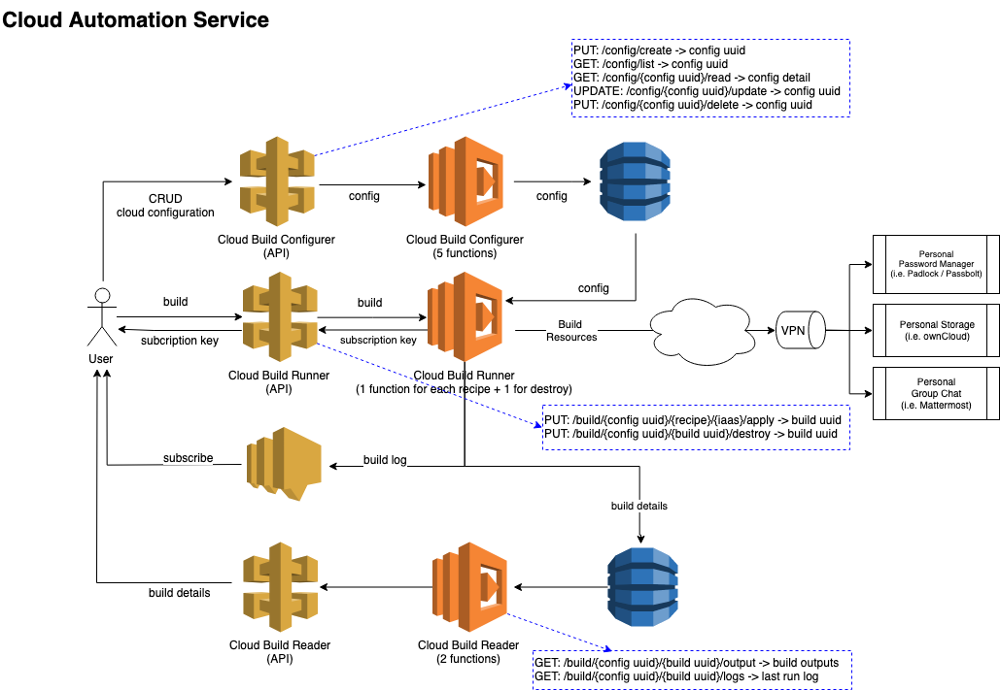
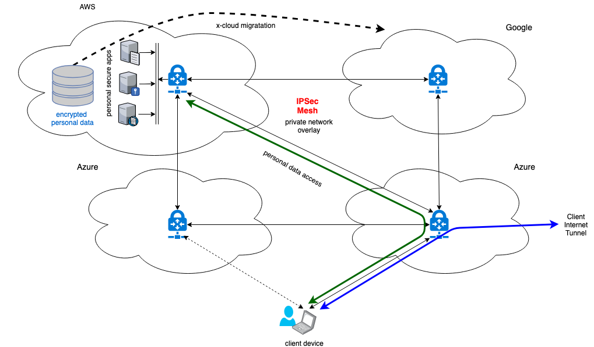
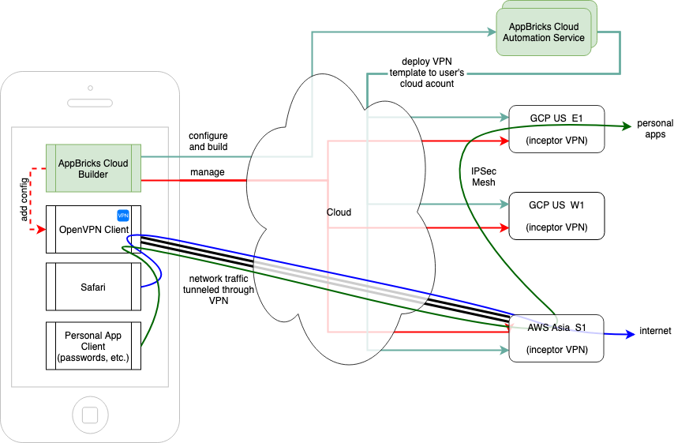
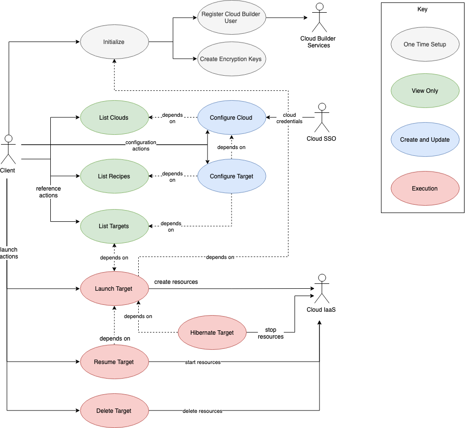

# Cloud Automation Service

## Overview

The automation service can be implemented either as a collection of AWS lambda functions behind an AWS API gateway invoked via a thin client application or executed locally via a thick client application such as a CLI. The underlying framework is based on the [Terraform](https://terraform.io) automation engine.

## Architecture

### Automation Services

The high-level architecture for a thin client that uses the automation services in the cloud is given in the diagram below.

The Cloud Builder mobile client invokes these cloud functions via a REST API Gateway as they cannot be run natively on mobile devices. Alternatively, the Cloud Builder desktop client and CLI will encapsulate these services and run them locally.

## Sandbox Network Architecture

These functions run Terraform recipes to build encrypted network meshes across multiple clouds. These sandboxed cloud virtual networks can then be used to host software and services at the same time ensuring encryption of data in motion and rest. Additional functions will provide the ability to migrate resources and encrypted data across clouds and optimize costs based on recommendations delivered via the client.

This mesh will also provide egress to the internet via a VPN tunnel. Access to all personal resources will also traverse the VPN nodes and then the IPSec/Wireguard network mesh providing a secure dark net for hosting personal services.

## Use Cases

### Client Launcher

The launcher use cases describe all client actions around launching cloud builder recipes using a cloud builder client application.

