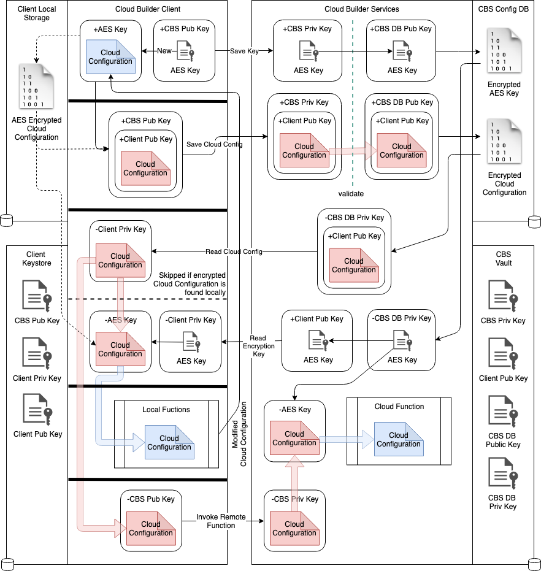
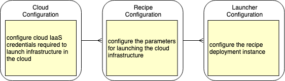

# Configuration

## Initialization

Running `cb init` on the current working folder will initialize that folder with a `.cb` folder containing encrypted configuration and state of environments built using the Cloud Builder cookbook's recipes. 

## Encryption

All configuration content is encrypted using AES with 256 bit keys. Encryption keys are created when `cb init` is run for the first time and saved in the system's keystore if one is available. For example when initialization is done on an IOS or OS-X device then the keys will be saved in the OS-X Keychain which can be backed-up to iCloud and shared across all devices logged into the same iCloud account.

## Configuration

The cloud credentials and configuration are encrypted and can be saved remotely. This enables the configuration to be shared across all clients on all devices in a secure manner. The approach to securing cloud credentials remotely is shown below.
 

Each client device will have its own public/private key pair which is created when it is installed first time on the device and initialized. This ensures a particular cloud configuration is coupled to the device from which it is populated. Cloud configurations may be shared with other client devices by encrypting the cloud configuration with that client's public key and saving it in the CBS Config DB.

The cloud configuration data is used as input to the cookbook recipes to build resources in the cloud. A configuration needs to be prepared for each target and saved for a "one-click" launch of a recipe customized for a particular target. The UX for defining the configuration for a particular target is shown below.
 

It is possible to only save cloud configurations locally. Such configurations will only be accessible on the device where they were created and cloud build operations will only be runnable locally.

## CLI

- The CLI saves the following configuration locally within a `.cb` folder within the working directory. The CLI will search the directory hierarchy for the `.cb` folder if one is not found within the current folder.
- The `.cb` folder has the following folders.
  - `cloud` - this folder contains encrypted configuration for each cloud provider. Each cloud provider will have a config file which contains the saved configuration as a JSON string.
  - `recipe` - this folder 
